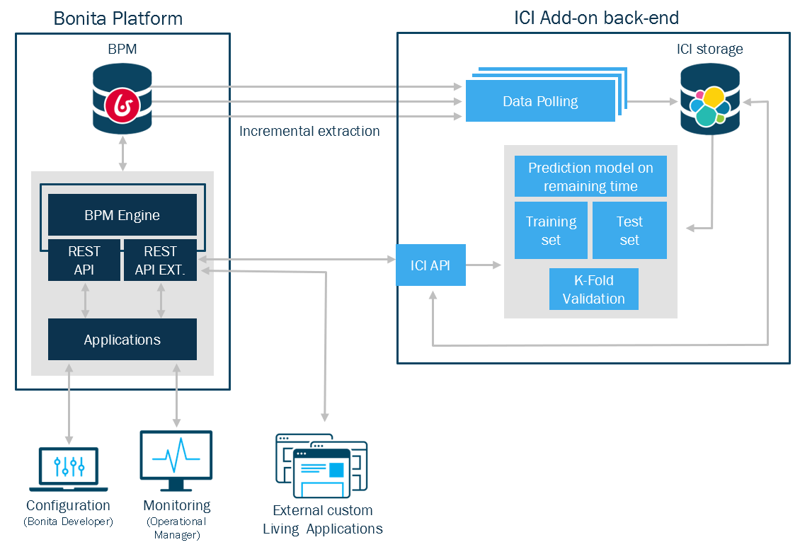

# Architecture

Bonita Intelligent Continuous Improvement Add-on (ICI) extracts data of the Bonita Engine database, transforms it, and stores documents in an Elasticsearch storage engine. A set of REST APIs allow to query this storage. Those APIs are used in two Living Applications deployed on Bonita Platform to configure processes and render predictions.   

## Overview

ICI connects to the Bonita Engine database, using its own connection pool to read events from the archives. 
Events are stored in Elasticsearch.

When configuring processes using the "Configuration" Living Application, a REST API extension calls the ICI REST API to store the configuration.

Data is polled from Bonita on a configurable time interval.  
Once configured, a prediction model is build, based on completed cases and then applied on open cases 
  
The "Operations Management" Living Application is a mobile first -usable on a desktop- UI which displays predictions.   

## Components

### ICI Server
 
The backend server polls data, creates process mining models, and serves the REST APIs.

### ICI Storage

It stores ICI data and predictive models, and it relies on Elasticsearch engine.

### ICI Configuration Living Application

This Living Application is used to configure the processes.

### ICI Operation Management Living Application

This Living Application is used to display case execution information and predictions to the Operation Managers.
  
