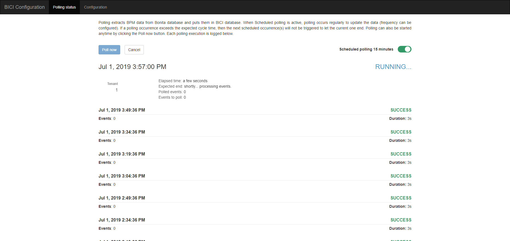
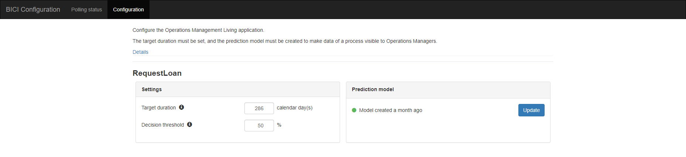

# Configure _BICI Operations Management_ Living Application

A living application is provided with the BICI Add-on to: 
* Manage polling - check [installation guide](installation_guide.md).
* Configure processes and compute prediction models.

## Polling

This page show what is the current status of the synchronization of the data between Bonita Platform and BICI storage.
In order to learn from the history of all executed processes in Bonita platform, BICI backend need to access and poll data from Bonita platform database.
The first time BICI backend is launched, all data regarding case and task execution is retrieved from the Bonita platform database.
Then, every 15 minutes (default configuration), a job updates the module with data of newly executed tasks and cases.

### Manage polling executions

The polling can be handled in BICI Configuration Living Application.

This page allows to:
* activate/deactivate the polling
* run it immediately
* cancel any running polling
* see previous polling executions

Refer to the [installation guide](installation_guide.md) for more details.

## Processes configuration

### Target duration

The target duration is a mandatory configuration to set. It allows the BICI Add-on to know what is a normal time execution for a given process. With this information, the algorithm computes a percentage of chances for the process instance to finish within this time.

In the page, the target duration is configurable in calendar days.

### Decision threshold

This configuration is set for each process.
It defines the percentage of likelihood to finish on time below which a case will be considered as *Predicted late*.

e.g. if the decision threshold is set at 80%, all cases with a percentage lower than 80% will be displayed as predicted late in the Monitoring view, and all cases with a percentage of 80% or higher will be considered as On time.
This use-case can be configured when the process is critical and any deviation must be tracked and trigger a corrective action. 

By default, this parameter is set at 50%.

### Create the model

A button is present to run the computation of the prediction model and apply it to every open case.

The model is then computed using all current history available in the BICI storage. You can at any time compute again the prediction model to take into account newly finished cases.
