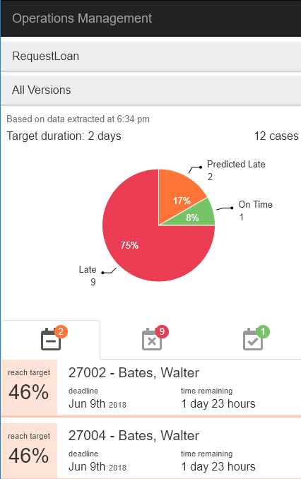

# Bonita Intelligent Continuous Improvement Add-on
This page explains the values and content of Bonita ICI Add-on,which is composed of a standalone application connected to Bonita Engine database, and two Living Applications: one for configuration, and one to monitor open cases and SLA compliance.

## Business values

### Decision support: short term improvement

This add-on provides a solution to support decision-making in the context of process execution that involves a compliance to "Service Level of Agreements".  

It is designed to help Operations Managers to insure that the execution of processes they supervise reaches efficiency standards, and as much as possible, avoid penalties that may occur when SLAs are not met.  

By analyzing data from the BPM archives, the ICI add-on predicts whether an open case has good chances to finish within the contractual SLA or not.  
Cases that are predicted late on the supervised processes are highlighted, so the operations manager can take corrective actions while there is still time, so as to improve the overall operational efficiency of the team.

This is made possible by implementing a process mining algorithm, that uses both timestamps of all BPM events and the id of each process instance in Bonita archives to build the path that each case has taken and its history.

### Descriptive analytics: long term improvement

The ICI Add-on also provides a solution to detect areas of improvements like fixing the process design or adapting the resources to workload peaks.
The data extracted from Bonita database can be used to build charts that give meaning to process execution.  
Process managers get to detect patterns, performance indicators and maybe pinpoint execution flaws.  

Highlights

Find out what’s in Bonita ICI Add-on! Read the release notes.

* [:fa-angle-double-right: Release Notes](release_notes.md)
<!--{ul:.menu .nav}-->

Getting started

Follow this guide with step-by-step instructions to start using Bonita ICI Add-on.

* [:fa-angle-double-right: Getting started with ICI](getting_started.md)
<!--{ul:.menu .nav}-->

Process mining

Learn more about what runs in the background.

* [:fa-angle-double-right:Process mining](process_mining.md)
<!--{ul:.menu .nav}-->

