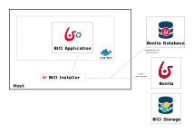

# Installation guide

This installation guide covers ways to install BICI with the provided installer, as well as detailed available parameters
values.
The installation process allows to deploy BICI resources on Bonita and relies on Docker to deploy the BICI Add-on.

Please also have a look on the [BICI architecture](architecture.md) 


## BICI deliverable content

The deliverable is composed of the BICI application, two BICI Living Applications, and the BICI installer.

```
bonita-ici-<VERSION>.zip
    |---- bici-application-<VERSION>.zip          // BICI application
    |---- la-configuration-<VERSION>.zip          // Living Application for BICI Configuration
    |---- la-operations-management-<VERSION>.zip  // Living Application for BICI Operations Management
    |---- la.properties                           // configuration file used to deploy BICI Living Applications
    |---- installation-guide.md                   // this documentation
    |---- configuration.properties                // sample configuration file
    |---- bin/bonita-ici                          // installer startup script
    |---- bin/bonita-ici.bat                      // installer startup script (Windows)
    |---- jdbc_drivers/                           // folder where to put the jdbc driver to connect to the Bonita Database
```


## General Prerequisites

For a detailed list of supported environment and tools, see the [prerequisites](prerequisites.md).


### Bonita

You need an up and running Bonita instance, the BICI Application will connect directly to the Bonita Database.


### BICI Storage

BICI Storage, which relies on Elasticsearch, even in a Docker container, requires a specific configuration of virtual memory
on the machine that hosts it. For more information, see [Elasticsearch documentation](https://www.elastic.co/guide/en/elasticsearch/reference/current/vm-max-map-count.html)

On a Linux host
```
# configure runtime environnement
sudo sysctl -w vm.max_map_count=262144
```
or edit file `/etc/sysctl.conf` file


## Using the installer

Extract the BICI deliverable on the host machine.

In the following, we will use `$BICI_INSTALLER_HOME` when noticing the directory where the installer has been extracted
on the host machine.

### Docker

The installer relies on Docker to deploy the BICI Add-on and is intended to be run on the Docker host directly

* Ensure you have Docker installed, using command `docker version`
* Docker requires an active Internet connection to pull the Elasticsearch Docker image and to build the BICI Application image

#### Windows OS

Due to a current limitation of the installer, you must set the `DOCKER_HOST` environment variable to let the installer
access to the Docker daemon

For instance
```
set DOCKER_HOST=tcp://localhost:2375
```


### Bonita Database access

Jdbc drivers for PostgreSQL, MySQL and MS SqlServer are already provided with the installer.

For Oracle only: copy the jdbc driver in `$BICI_INSTALLER_HOME/jdbc_drivers`.


## Full installation using the installer

This mode is designed to get a fully functional BICI Add-on including BICI Application, BICI Storage and BICI Living
Applications for configuration and operations management.


### Full installation overview


### Installation

Run the installer using `bonita-ici` (`bonita-ici.bat` on Windows platform) script that is located inside the `bin` folder

:::info
use `./bonita-ici --help` to display all options
:::

By default, this installer performs the following operations:
* `stopApp`: stop and remove any existing BICI Application running (Docker container)
* `stopStorage`: stop and remove any BICI Storage (elasticsearch) Docker container
* `startStorage`: start an Elasticsearch Docker container
* `startApp`: configure and deploy the BICI Application as a Docker container
* `deploy`: deploy the BICI Living Applications configured to run on top of this installation.


### BICI Installer Configuration

### Pass parameters interactively

All required parameters are asked in the command line.


### Pass parameters using configuration file

Parameters can be passed using a configuration file.

Example:
```
./bonita-ici --file configuration.properties
```

The sample configuration file named `configuration.properties` contains all properties that can be configured.

### BICI Living Applications deployment

You must update the `la.properties` configuration file to ensure the BICI Living Applications are able to communicate with the BICI Application.

### Https configuration

`https` is activated by default on the BICI Application. 

There are two ways to configure it.

#### Self-signed certificate

:::info
This is not recommended for a Production use of BICI. It is recommended to get your own certificate.
:::

If you don't already have a valid certificate for you platform or does not know what it is, choose this option.
A certificate will be generated for you based on configuration settings provided to the installer.

:::info
When using this kind of certificate, the Bonita JVM must be restarted each time the BICI Application and Living Applications
are reinstalled.
:::


#### Provide your own certificate

If you already have a certificate and the associated private key of your domain, it can be given to the installer to be used in the backend to enable the https.

This certificate and the private key must be passed to the installer in a format compatible with the Java KeyStore. 

Common supported formats are JKS and PKCS12.

##### Example using LetsEncrypt's certbot:

Generate a certificate for your local machine using the certbot of Lets encrypt using the following command line.
```
certbot certonly
```
(For more information, go to [Let's Encrypt documentation](https://letsencrypt.org/getting-started/))

Convert the certificate given by LetsEncrypt into a PKCS12 format.
```
openssl pkcs12 -export -in /etc/letsencrypt/live/{domain}/fullchain.pem -inkey /etc/letsencrypt/live/{domain}/privkey.pem -out mykey.p12 -name myAlias
```

Then when using the installer provide this generated file as a keystore, the same password for the keystore and the key, and the same alias.


#### Update the certificate

When the certificate expires, it can replaced by a new certificate generated by the installer or one that you provide.

Replace it by reinstalling the BICI Application and BICI Living Applications:
* stop the BICI Application using `bonita-ici stopApp`
* start the BICI Application and redeploy BICI Living Applications using either the new certificate or newly generated one
using `bonita-ici startApp deploy`

If the certificate is autogenerated, the Bonita JVM needs to be restarted.


### Stop the BICI Application

It can be stopped using `bonita-ici stopStorage stopApp`

In that case, the BICI Application and Storage containers are dropped


### Advanced polling profile mode

:::info
This mode is only available when Bonita is using: Oracle or PostgreSQL Database
:::

This mode requires that the database user is allowed to create materialized views.
To grant this in:

- Oracle

    - `GRANT CREATE MATERIALIZED VIEW TO <USER>` using a SYS connection prior to start the application.

- PostgreSQL

    - `GRANT CONNECT ON DATABASE <DB_NAME>> TO <USER>` is sufficient to create a view
    - `GRANT SELECT ON TABLE <SCHEMA>.arch_flownode_instance TO <USER>` is needed to REFRESH MATERIALIZED VIEW

To activate this mode when using the configuration file, set
```
polling.profile=advanced
```

When using the interactive installer mode, answer `advanced` when the `Enter Polling profile` question is asked


## Installation with a manually installed Elasticsearch

### Overview

In that case, you request the BICI installer to perform the same operations as in the full installation but it will not
try to start the BICI Storage Docker container and it will use the instance specified by configuration.




### BICI Installer Configuration

If you want to use a your own manually installed Elasticsearch, change the following properties in the `configuration.properties` file:
```
elasticsearch.port=<port of the elasticsearch>
elasticsearch.host=<host of the elasticsearch>
```

If you use the interactive installer mode, provide the host and port of the running Elasticsearch instance when requested
by the installer.


### Installation

Then run the installer like this (pass the configuration file option if needed):
```
bonita-ici startApp deploy 
```

## Troubleshooting

### Polling errors

When a polling execution fails, it can be seen in error in BICI Configuration Living Application.

More information is available in the logs of the BICI Application Docker container.
To find the logs you must get the ID of the BICI Application docker container:
```
docker container ls
```
Next, typing the following command will display the logs:
```
docker logs CONTAINER_ID        \\i.e. docker logs 2e169fd6c305
```
