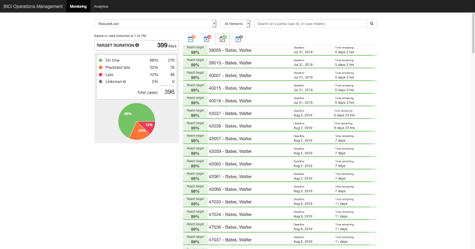
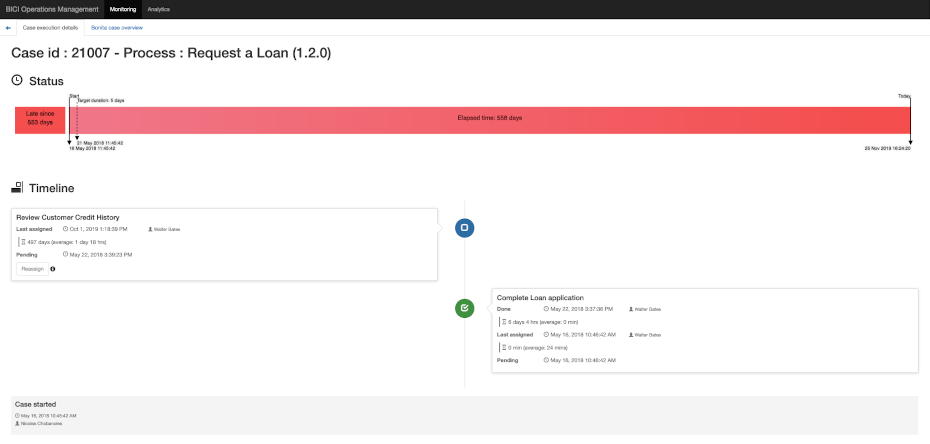
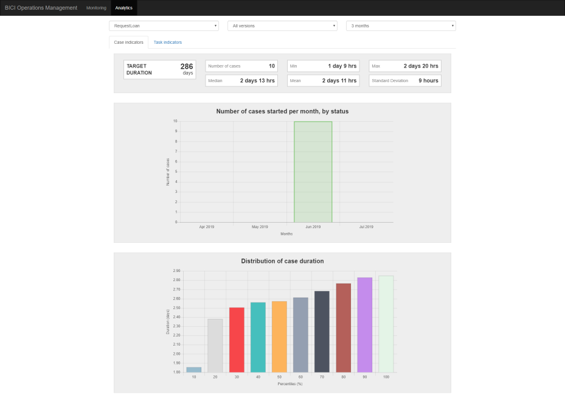
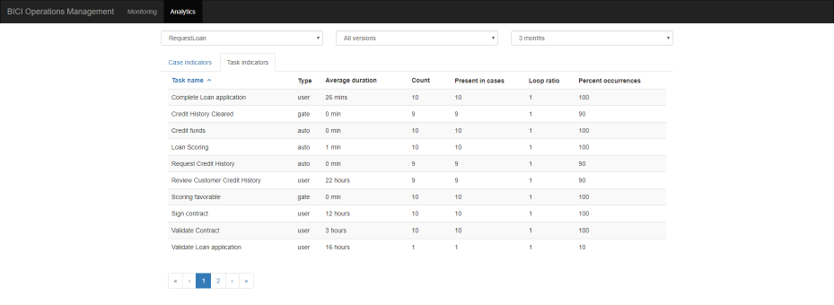

# Operations Management

The Operations Management Living Application contains pages that allow Operations Managers to monitor cases with more information than they could normally get by looking at cases execution.
This application is made of two menu options.

## Monitoring page

This view is filtered by process and optionally process version.
The artificial intelligence algorithm applies a prediction to each case: its likelihood to finish within the target duration, given two parameters: its execution flow so far and the time remaining before the target duration.

Based on this information, the page shows a pie chart with the proportion of cases *Late* (already behind the deadline), *Predicted late* (likelihood is below 50%), and *On time* (likelihood is 50% or above). 
The decision threshold that makes cases *Predicted late* or *On time* can be configured in the [Configuration Living Application](configure.md). 

It also contains a tabbed list of cases that identifies each case by its ID as well as the name of the initiator. 
For each case *On time* and *Predicted late*, the likelihood to finish on time and the remaining time are also displayed.
For *Late* cases, the amount of time the case has been late, as well as the initial due date are displayed.

### Case information

A click on a particular case displays its details on 2 tabs: 
- Case execution details
  - The case progress bar showing time events(start, target duration) and the status(reach target probability, late since x days)
  - The case timeline showing all human tasks already done as well as the current tasks and their assignees if identified.
- Bonita case overview
  - The current business data values

This helps Operations Managers make the best short-term decision to put operations back on track if needed, and organize the team's activity.

#### Attention
For the case, to have the prediction information displayed on the Monitoring Page, following condition must be met: at least 100 cases must get through the process's path.
If in the process there are existing paths with less than 100 cases passed, all of these cases will be presented here without the prediction information.

If there are recent updates concerning the number of cases passing through the process's path and the previous situation have changed (there is now 100 or more cases that went through the path), than polling must be redone and model must be recomputed.
Only after that, the prediction information will be available for these cases in the Monitoring Page.

## Analytics page

This page takes advantage of Bonita ICI storage, and the opportunity it gives to query archived cases database to get trends on raw indicators, as well as a comparison to Key Performance Indicators.
This view is filtered by process and period of time, and can also be filtered by process version.
It is made of 2 tabs.

### Case indicators

In this tab there are 3 major sections:

#### Statistics indicators on case duration
Over the period of time selected, minimum duration, maximum duration, mean, median and standard deviation are provided.
The target duration is recalled as a KPI for comparison.

#### Number of cases opened per month, sorted by status at the time they ended (on-time or late)
Over the time period selected, this stacked bar chart gives an overview of the number of cases opened by month.
A partition of the bars stands for the cases that have ended in the *On time* status, the other partition stands for the cases that have ended in the *Late* status. The counts of each partition are indicated in the tooltip of each bar. 

#### Distribution of case duration
This bar chart gives the percentiles.

In descriptive statistics, a percentile is each of the 99 values that divide the sorted data into 100 equal parts, so that each part represents 1/100 of the population sample.

The percentiles are represented by graphs that indicate the case duration and are defined by numbers: 10, 20, 30, 40, 50, 60, 70, 80, 90, 100. 

##### How to interpret percentiles ?
For example, for the 30th percentile, the case duration is 2 days, which means that 30% of the archived cases considered ended within 2 days.

### Task indicators

In this tab, there is a table that displays Task statistics such as average duration, count, loop ratio, etc...

Raw values, trends, and comparisons with the KPI will help decision making for the continuous improvement of process execution and user experience.
